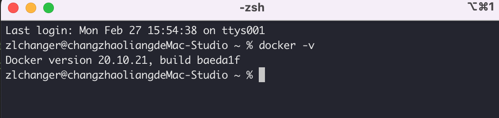

## 1、背景

在使用docker以前，公司的项目都是先将代码上传代码库，在远程服务器上编写脚本-拉取代码-编译打包-运行。
如果遇到了回滚到之前版本，还需要回忆下之前的分支版本。运气差的时候，还要处理下服务器的环境，比如java版本不对，比如gradle版本太低了。总结起来就是麻烦，繁琐。

但是，自从切换了docker之后，一切都简单了。

## 2.介绍

Docker可以让开发者打包他们的应用以及依赖包到一个轻量级、可移植的容器中，然后发布到任何流行的 Linux 机器上，也可以实现虚拟化。容器是完全使用沙箱机制，相互之间不会有任何接口（类似 iPhone 的 app）,更重要的是容器性能开销极低。

## 3.docker 安装

* mac环境下直接下载安装docker desktop就行
* centos 安装 
  - 注意docker支持64位版本、内核最低要求是3.10。
  - 安装前先卸载旧版本

    $ sudo yum remove docker \
                    docker-client \
                    docker-client-latest \
                    docker-common \
                    docker-latest \
                    docker-latest-logrotate \
                    docker-logrotate \
                    docker-selinux \
                    docker-engine-selinux \
                    docker-engine

  - yum 安装

    $ sudo yum install -y yum-utils

  - 安装 Docker

    $ sudo yum install docker-ce docker-ce-cli containerd.io

  - CentOS8 额外设置 （由于 CentOS8 防火墙使用了 nftables，但 Docker 尚未支持 nftables， 我们可以使用如下设置使用 iptables：更改 /etc/firewalld/firewalld.conf）

    
    # FirewallBackend=nftables
    FirewallBackend=iptables

  - 启动 Docker

    $ sudo systemctl enable docker
    $ sudo systemctl start docker

## 4.检测docker是否安装完成

    docker -v
