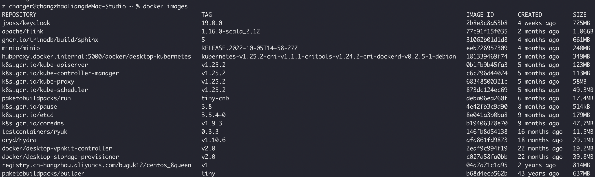
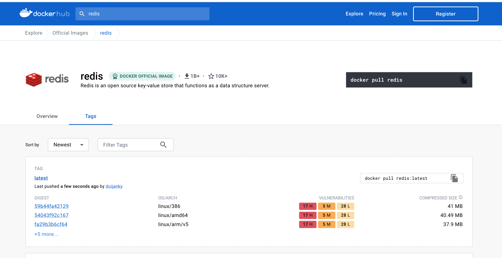

## 1、什么是docker镜像

在学习docker的过程中，我们经常看到的词汇便是镜像、容器、dockerfile之类的，那什么是镜像。

docker的镜像文件就好比待运行的jar包，里面包含了容器启动所需要的文件内容结构以及一些默认配置项，我们可以将它传输到任何需要运行的地方进行运行。
其内部的文件内容以及配置项构成了容器运行的基础环境-rootfs（docker容器的根目录）。

## 2、docker镜像仓库（registry）

当我们想要在宿主机上运行某个容器，例如redis。我们需要先获取docker redis的镜像文件。此时我们可以使用命令【docker images】来查看当前宿主机已存在的镜像文件

从上图可以看到，我们当前的宿主机没有redis的镜像文件，这是我们就需要从registry上下载镜像并保留到宿主机上。

registry就好比maven仓库一样，只不过registry中保存的都是已经docker镜像。

- 我们可以从官方的registry中拉取镜像（hub.docker.com）

- 我们也可以使用自定义registry,构建自己的私有镜像仓库。(ps：阿里云、腾讯云都提供了私有的镜像仓库)。

## 3、镜像组（repository）

从上面我们拉取的docker image列表看，一个镜像包含一个repository、tag、image_id，而当我们使用docker pull命令时，我们需要给出一个具体的镜像索引。

    $ docker pull redis:alpine

这里redis就是repository， alpine代表的tag。就好比maven仓库的java。相同的group-Id、artifact-Id的代表一个的maven组，一个组下面有多个版本的依赖包。
同样，registry的结构也是如此，一个registry是repository的结合，一个repository下面有多个tag不同的镜像。

## 4、docker镜像基础命令

### 4.1、docker build

